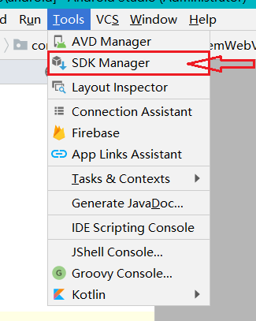
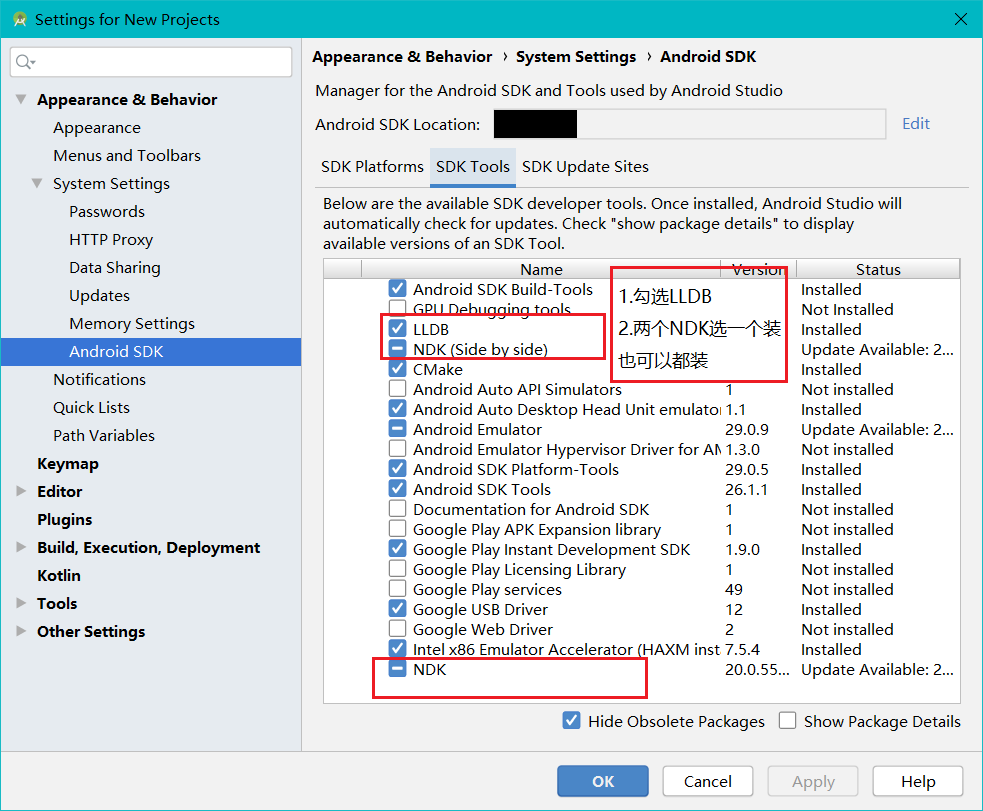

==================================================
# 山西农业大学手机成绩查询
山西农业大学学生教务系统是学生用来查成绩、选课、修改密码、教学评估等的系统，是基于JSP网页的应用程序。由于网页没有针对移动设备（特别是手机）进行优化，在手机端查看时很不舒服，需要经常调整页面比例。针对这个弱点，利用所学习的Android知识，查看教务系统的后台获取JSON数据，使查询成绩功能更好地适配安卓客户端。<br>
<p>山西农业大学软件学院移动互联1703班<br>
张乘铭
</p>

## 环境配置
建议使用 Android Studio 3.5.1 及以上版本, 使用本项目时将自动下载 gradle5.5.1。
## 首次使用
首次使用时, 请使用Android Studio下载项目所需依赖。<br>
1. 用Android Studio打开本项目
2. 依次点击菜单中Tools->SDK Manager,如图所示。<br>

3. 如图，安装NDK,LLDB(切换到SDK Tools选项卡)<br>

如果两个NDK都安装,则需要在下一步的配置文件中指定一个NDK路径。
4. 安装完成后,检查[配置文件](./local.properties)项目目录local.properties中是否含有ndk.dir,有则表示配置成功<br>

## 运行
### 1. bash for linux,macOS,ChromeOS and other UNIX-based Operating System
```bash
chmod +x ./gradlew.sh
./gradlew.sh clean build bundle
```
### 2. bash for Windows
```cmd
.\gradlew.bat clean build bundle
```
&copy;版权所有 2019-2020山西农业大学软件学院 李富忠 成丽君
